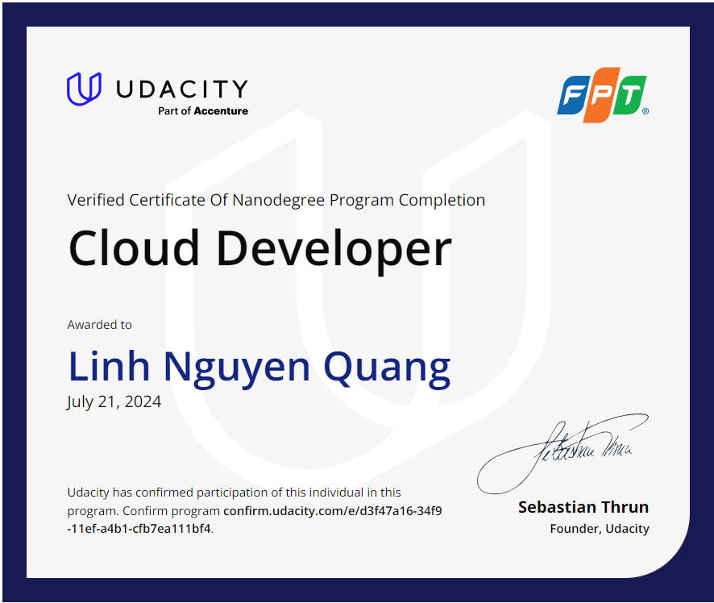
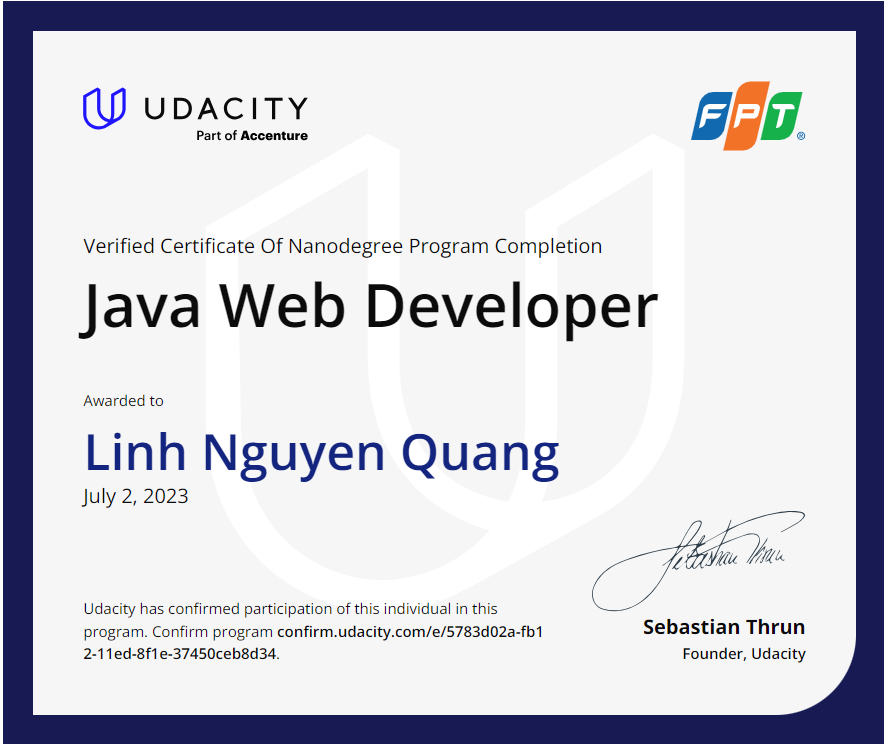
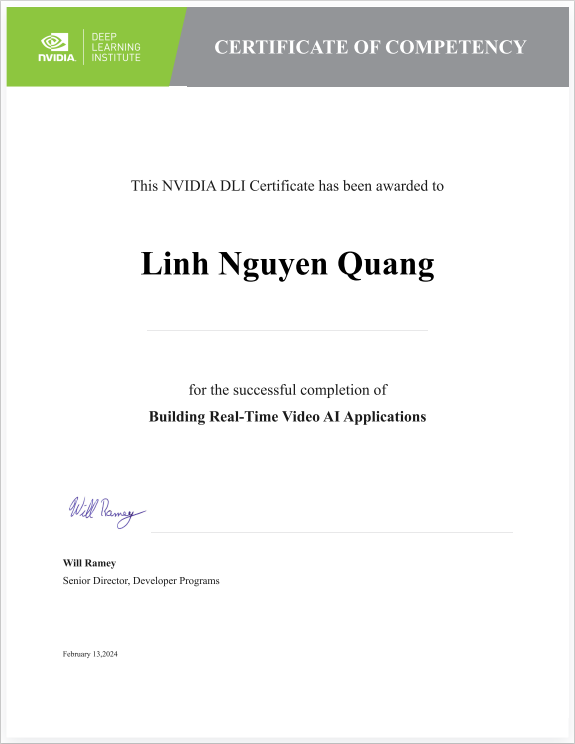

## Nguyen Quang Linh 💛

🔭 **Tech Stack**:  
-**Languages**:  Java, HTML/CSS, JavaScript, Typescript, Java Spring Boot 
-**Platforms:** Docker

📖 **Bio**:
Coding is my life!

🌐 **Connect with me**:

---

# 📊**GitHub Stats**:
 

---

### Udacity

    
    

### NVIDIA

    

